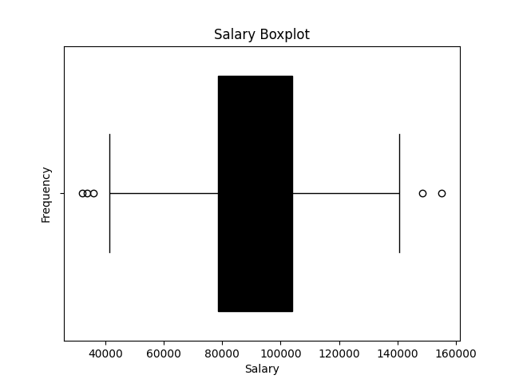

AI Job Market Insights Analysis
Overview

This project explores the AI job market using a dataset that contains information about job titles, industries, company size, locations, AI adoption levels, automation risk, required skills, salaries, remote-friendliness, and job growth projections.

The goal of this analysis is to:

$ Understand the distribution of AI jobs across industries.

$ Explore salary trends and variability.

$ Identify key skills in demand.

$ Visualize remote work trends and automation risks.

Dataset Columns:
| Column Name             | Description                                           |
| ----------------------- | ----------------------------------------------------- |
| `Job_Title`             | Name of the job position                              |
| `Industry`              | Industry or sector of the company                     |
| `Company_Size`          | Size of the company (Small/Medium/Large)              |
| `Location`              | Job location (city/country)                           |
| `AI_Adoption_Level`     | Level of AI adoption in the company (Low/Medium/High) |
| `Automation_Risk`       | Risk of job automation (Low/Medium/High)              |
| `Required_Skills`       | Skills required for the job                           |
| `Salary_USD`            | Annual salary in USD                                  |
| `Remote_Friendly`       | Indicates if the job is remote-friendly               |
| `Job_Growth_Projection` | Expected job growth trend                             |

Visualizations:

### 🔹 Industry Count
Shows the number of AI jobs in each **industry**.  
Helps identify which sectors are hiring the most AI talent.  

Explanation:

$ Taller bars indicate industries with more AI job postings.

$ Helps identify key sectors where AI skills are most in demand.

### 🔹 Salary Distribution
Shows the **spread of salaries** for AI jobs.  
Helps understand salary ranges and variability across roles.  

Explanation:

$ The box represents the interquartile range (middle 50% of salaries).

$ The line inside the box is the median salary.

$ Whiskers and outliers show the spread and extreme salaries.

$ Gives an overview of salary variability across AI jobs.

Key Insights:

$ Most AI jobs are concentrated in [top industries].

$ Salary varies significantly across job roles and industries.

$ Companies with higher AI adoption levels tend to offer higher salaries.

$ Remote-friendly AI jobs are increasingly common.

